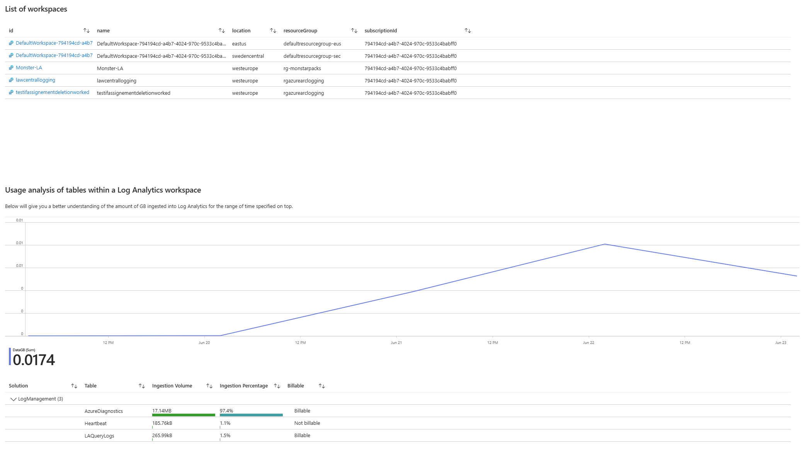
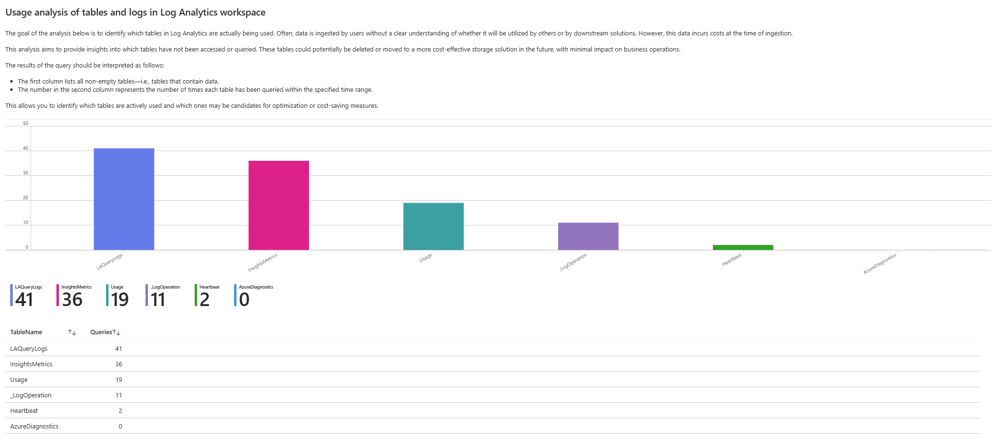
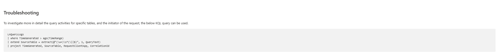

# Azure Log Analytics Cost Optimization

This repository contains KQL queries and an Azure Workbook template to help you analyze and optimize the cost and usage of your Log Analytics workspaces.  

You can use these resources to identify data ingestion trends, review table usage, and uncover opportunities to reduce unnecessary costs in your Azure Monitor environment. The latter is particularly valuable, as this workbook highlights tables that are ingesting data into Log Analytics but are rarely—or not at all—queried. This insight enables you to reduce or even eliminate data ingestion into those tables, helping to optimize costs.

## How the solution works

At a high level, this solution leverages several Azure services and automation steps to help you optimize your Log Analytics costs:

- **Azure Policy**: A custom policy is deployed and assigned to your subscription. This policy ensures that diagnostic settings are configured on all Log Analytics workspaces to capture Audit logs about query activities.
- **Diagnostic Settings**: The policy automatically configures diagnostic settings on each workspace, so that query and ingestion activities are logged for analysis.
- **Remediation Task**: To apply the policy to existing workspaces, a remediation task is created. This ensures all current workspaces are compliant and have the required diagnostic settings.
- **KQL Queries & Azure Workbook**: The captured logs are analyzed using KQL queries, and the results are visualized in an Azure Workbook. This workbook provides insights into table usage, data ingestion, and opportunities for cost optimization.

**Steps overview:**
1. Deploy the custom Azure Policy and assign it to your subscription.
2. Run a remediation task to apply the policy to all existing Log Analytics workspaces.
3. Deploy the provided Azure Workbook to visualize and analyze your workspace data and costs.

***Note***: After the workbook is created, it may take some time before data starts appearing. This is because data collection only begins once the policy has been enforced and the diagnostic setting has been configured for the Log Analytics workspaces. Please allow 5–10 minutes for the first data to be ingested.

***Disclaimer***: The workbook currently analyzes interactive queries and does not take into account queries executed by alert rules that may be configured in your environment. This means tables that appear "unused" might actually be actively queried by alert rules. I'm currently working on integrating alert rule query insights into the workbook to provide a more complete usage analysis.

These steps automate the process of collecting, analyzing, and visualizing usage data, enabling you to make informed decisions to optimize your Log Analytics costs.

## How to implement the solution

#### 1. Clone the repository
``` 
git clone https://github.com/claestom/lawcostoptseries.git ; cd "lawcostoptseries/01_Detect_Unused_Tables"
```
#### 2. Create the Policy definiton & the assignment to your subscription

```
cd scripts ; ./create-policy-assignment.ps1 -SubscriptionId "xxxxxxxx-..."
```
#### 3. In order for the Policy to have effect on the existing workspaces, create a remediaton task
```
./create-remediation.ps1 -SubscriptionId "xxxxxxxx-..."
```
#### 4. Deploy the workbook using the Bicep file
```
cd ../template ; az deployment group create --subscription 'xxxxxxxx-xxx...' --resource-group "xxx" --template-file arm.bicep
```

### Example of the workbook:





In this example, the AzureDiagnostic has been ingesting the most data in the specified time interval, however, it hasn't been queried once in the same interval. In order to optimize the cost, we could:

* Lower the data ingestion by applying transformations or lowering the sample rate
* Removing the table and stop the ingestion as a whole


## Feedback & Contributions

I would love to hear your opinions and feedback on this solution! If you have suggestions, improvements, or questions, please feel free to open an issue or start a discussion. Contributions are always welcome—raise a pull request (PR) or an issue to help make this project even better.
