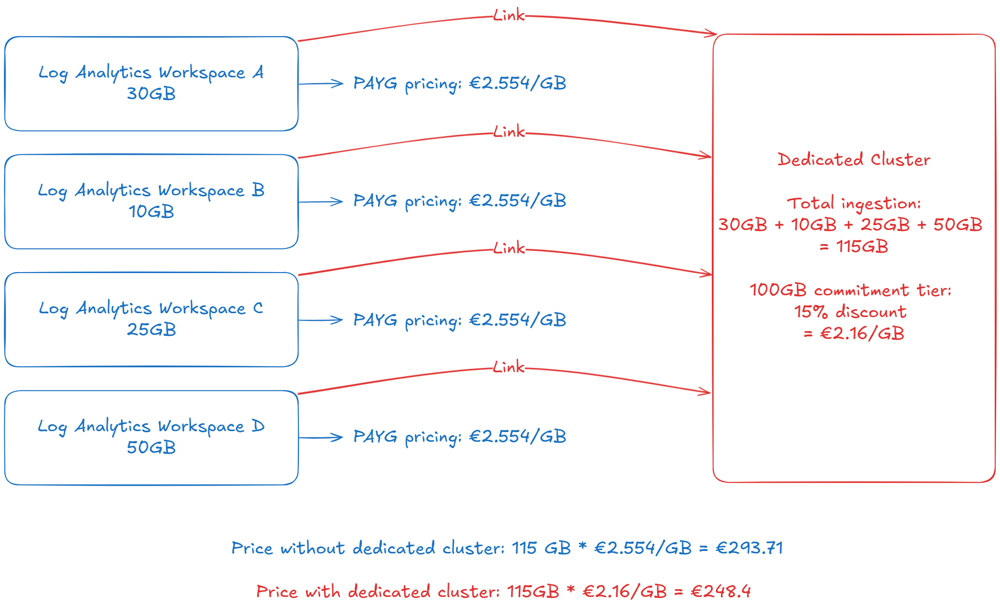

# Log Centralization, Commitment Tiers & Dedicated Clusters

## Introduction

Welcome to Part 3 of our comprehensive 5-part Azure Log Analytics cost optimization series. In [Part 1](../01_Detect_Unused_Tables/), we explored identifying and removing unused tables, and in [Part 2](../02_Log_Classifications/), we optimized costs through strategic table plan selection. Now, we turn our attention to **architectural cost optimization strategies** that can deliver enterprise-scale savings through log centralization, commitment tiers, and dedicated clusters.

As your Azure environment grows, the traditional pay-as-you-go pricing model for Azure Monitor Logs can become increasingly expensive. This part focuses on leveraging Azure's volume-based pricing tiers and architectural patterns to achieve significant cost reductions—often 30-50% or more—while improving operational efficiency and centralized management.

### What You'll Learn in This Part

This guide covers Azure Monitor pricing fundamentals and how commitment tiers provide predictable, volume-discounted pricing for consistent workloads. You'll understand when and how to implement dedicated clusters for large-scale environments, along with practical strategies for log centralization that maximize cost efficiency while maintaining security and compliance requirements.

Whether you're managing distributed workspaces across multiple subscriptions or planning for future growth, this guide provides the architectural foundation needed to optimize costs at enterprise scale.

*This is Part 3 of our 5-part series covering: Part 1 - Unused Tables, Part 2 - Table Plans, **Part 3 - Centralization & Commitment Tiers** (this article), Part 4 - Data Ingestion Control, and Part 5 - Advanced Optimization Strategies.*

## Azure Monitor Pricing & Commitment Tiers

### Understanding Azure Monitor Pricing Models

Azure Monitor Logs offers multiple pricing models designed to accommodate different usage patterns and provide cost optimization opportunities:

**Pay-As-You-Go (Default)**
- **Pricing**: $2.30/GB for Analytics tables
- **Best For**: Variable or unpredictable data volumes
- **Billing**: Monthly based on actual data ingested
- **Flexibility**: No commitment, scale up or down anytime

**Commitment Tiers (Volume Discounts)**
- **Pricing**: Discounted rates starting at 100GB/day commitment
- **Best For**: Predictable, consistent data ingestion patterns
- **Billing**: Fixed daily commitment regardless of actual usage
- **Savings**: 15-30% discount depending on commitment level

### Available Commitment Tiers

Azure Monitor Logs commitment tiers provide substantial cost savings for consistent workloads:

**100 GB/day Tier**
• **Cost**: ~$196/day (~15% savings vs pay-as-you-go)
• **Monthly Equivalent**: ~$6,000/month
• **Best For**: Medium enterprises with 3TB/month consistent ingestion

**200 GB/day Tier**
• **Cost**: ~$368/day (~20% savings vs pay-as-you-go)
• **Monthly Equivalent**: ~$11,000/month
• **Best For**: Large enterprises with 6TB/month consistent ingestion

**Higher Tiers Available**
• **500 GB/day**: ~25% savings
• **1 TB/day**: ~30% savings
• **2 TB/day and above**: Contact Microsoft for enterprise pricing

**Important Considerations**:
- Commitment tiers are **daily commitments** - you pay the full amount even if you ingest less
- **Break-even analysis** is crucial - ensure consistent usage meets or exceeds commitment
- **Overage charges** apply at standard rates when exceeding daily commitment
- **30-day minimum commitment** with ability to change tiers monthly

**Not reaching commitment tiers on individual workspaces?** If your individual workspaces don't meet the minimum 100GB/day threshold for commitment tier savings, dedicated clusters can be a game-changer. They allow you to aggregate data ingestion across multiple workspaces to collectively reach commitment tier thresholds, unlocking volume discounts that wouldn't be available to individual smaller workspaces.

For current pricing details, see [Azure Monitor pricing](https://azure.microsoft.com/en-us/pricing/details/monitor/).

## Dedicated Clusters: What, Why, and How

### What Are Dedicated Clusters?

Azure Monitor Dedicated Clusters are isolated compute and storage environments that provide enhanced control, predictable performance, and significant cost savings for large-scale log analytics workloads.

**Key Characteristics**:
- **Minimum commitment**: 100 GB/day (though CLI minimum is currently 500 GB/day, use REST to configure lower commitment tiers with minimum of 100 GB.)
- **Isolated infrastructure**: Dedicated compute and storage resources
- **Regional scope**: Can link up to 1,000 workspaces in the same region
- **31-day commitment period**: Can increase tier anytime, but must wait 31 days to decrease

> **⚠️ Important Regional Requirement**: Log Analytics workspaces must be deployed in the same region as the dedicated cluster. Cross-region linking is not supported.

### Why Choose Dedicated Clusters?

**Primary Focus: Cost Optimization Benefits**:
- **Volume discounts**: Commitment tier pricing starting at 100 GB/day
- **Predictable costs**: Fixed daily commitment simplifies budgeting and planning
- **Consolidated billing**: Link workspaces across different subscriptions to one cluster
- **Flexible billing attribution**: Choose between cluster-level or workspace-proportional billing

**Key Cost Advantage - Data Aggregation**: The most compelling cost benefit of dedicated clusters is the ability to combine data ingestion across multiple workspaces to reach commitment tier thresholds. This is ideal for scenarios where individual workspaces might only ingest 20-50 GB/day, but collectively across 5-10 workspaces, you reach the 100+ GB/day minimum for significant volume discounts. An example below:

For comprehensive information about dedicated clusters, including capabilities, detailed implementation guides and advanced configuration options, see the [official Azure Monitor dedicated clusters documentation](https://learn.microsoft.com/en-us/azure/azure-monitor/logs/logs-dedicated-clusters). 

### How to Implement Dedicated Clusters

**Cost-Focused Planning Steps**:
1. **Assess current usage**: Analyze combined workspace ingestion to ensure 100+ GB/day minimum
2. **Calculate ROI**: Compare cluster commitment tier costs vs current pay-as-you-go expenses
3. **Plan workspace consolidation**: Identify workspaces in the same region for optimal cost aggregation

**Implementation Overview**:
1. **Create cluster**: Deploy with appropriate commitment tier based on cost analysis
2. **Link workspaces**: Connect existing workspaces to begin cost optimization
3. **Monitor and adjust**: Track utilization vs commitment to optimize tier selection

**Key Implementation Notes**:
- Provisioning takes ~2 hours; workspace linking up to 90 minutes
- Billing starts immediately upon cluster creation
- Historical data remains in original locations; only new data uses cluster

For detailed step-by-step implementation guides, configuration options, and troubleshooting, see the [Azure Monitor dedicated clusters implementation documentation](https://learn.microsoft.com/en-us/azure/azure-monitor/logs/logs-dedicated-clusters).

### Best Practices

**Capacity Planning**:
- **Start conservative**: Begin with minimum viable commitment tier (100GB/day)
- **Monitor utilization**: Track daily ingestion vs commitment to optimize tier selection
- **Plan for growth**: Consider future data ingestion trends and business expansion
- **Overage management**: Monitor overage charges when exceeding daily commitment

**Workspace Organization for Cost Optimization**:
- **Regional consolidation**: Link workspaces within the same region to maximize cluster benefits and avoid cross-region charges
- **Aggregate smaller workspaces**: Combine workspaces with lower individual ingestion to reach commitment tier thresholds

For additional best practices including security, compliance, and operational considerations, see the [Azure Monitor dedicated clusters documentation](https://learn.microsoft.com/en-us/azure/azure-monitor/logs/logs-dedicated-clusters).

### When to Consider Dedicated Clusters

**Cost-Driven Ideal Scenarios**:
- **Large enterprises** with consistent 100+ GB/day ingestion (500+ GB for significant benefits)
- **Multi-subscription environments** where aggregating workspaces enables commitment tier savings
- **Distributed workspaces** with combined ingestion meeting minimum thresholds

**Cost Break-Even Analysis**:
Dedicated clusters become cost-effective when:
- **Combined workspace ingestion** consistently meets or exceeds commitment tier
- **Volume discounts** offset the fixed daily commitment costs
- **Predictable workloads** justify commitment tier pricing over pay-as-you-go

**When NOT to Use Dedicated Clusters**:
- **Small environments** with <100 GB/day consistent ingestion
- **Highly variable workloads** with unpredictable data patterns that may not meet daily commitments
- **Single workspace environments** without the need for data aggregation benefits

For additional scenarios including compliance, performance, and operational considerations, see the [Azure Monitor dedicated clusters documentation](https://learn.microsoft.com/en-us/azure/azure-monitor/logs/logs-dedicated-clusters).

### Pricing Model Details

**Commitment Tier Structure**:
- **Daily commitment**: Fixed cost regardless of actual daily ingestion
- **Overage charges**: Standard per-GB rates apply when exceeding commitment
- **Tier flexibility**: Can increase tier anytime; 31-day wait to decrease
- **Billing attribution options**:
  - **Cluster billing** (default): All costs attributed to cluster resource
  - **Workspace billing**: Costs distributed proportionally across linked workspaces

For detailed pricing information, see [Azure Monitor Logs pricing details](https://learn.microsoft.com/en-us/azure/azure-monitor/logs/cost-logs#dedicated-clusters).
