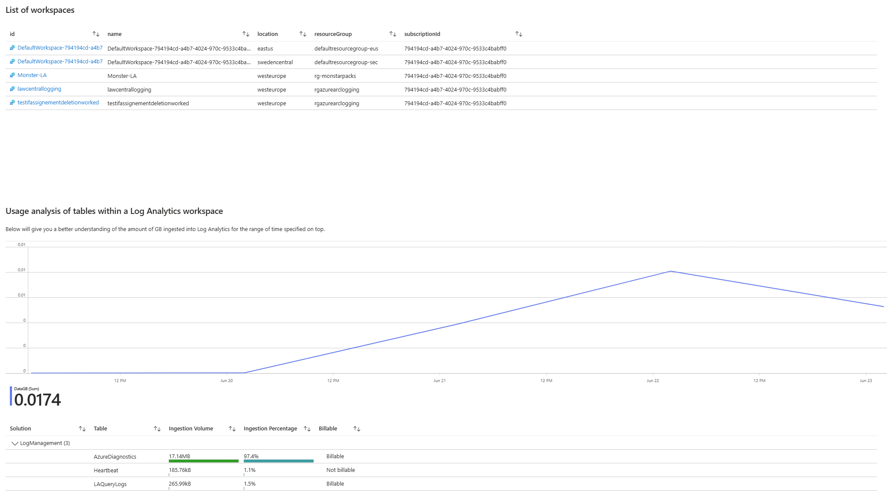

# Azure Log Analytics Cost Optimization

This repository contains KQL queries and an Azure Workbook template to help you analyze and optimize the cost and usage of your Log Analytics workspaces.  

You can use these resources to identify data ingestion trends, review table usage, and uncover opportunities to reduce unnecessary costs in your Azure Monitor environment. The latter is particularly valuable, as this workbook highlights tables that are ingesting data into Log Analytics but are rarely—or not at all—queried. This insight enables you to reduce or even eliminate data ingestion into those tables, helping to optimize costs.

## How to implement the solution

#### 1. Clone the repository
``` 
git clone https://github.com/claestom/lawcostoptseries.git ; cd lawcostoptseries
```
#### 2. Deploy the Diagnostic Settings required to your Log Analytics Workspace

In order to for the workbook to get insights in the query activities of the tables, the Audit logs need to be captured from the Log Analytics workspaces. This will be done using Diagnostic Settings and in order to scale and automate this, a custom Azure Policy was created for this solution. The following command will create the custom Policy definition and assign it to your subscription.

```
cd scripts ; ./create-policy-assignment.ps1 -SubscriptionId "xxxxxxxx-..."
```
#### 3. In order for the Policy to have effect on the existing workspaces, create a remediaton task
```
cd scripts ; ./create-remediation.ps1 -SubscriptionId "xxxxxxxx-..."
```
#### 4. Deploy the workbook using the Bicep file
```
cd ../template ; az deployment group create --subscription 'xxxxxxxx-xxx...' --resource-group "xxx" --template-file arm.bicep
```

### Example of the workbook:




